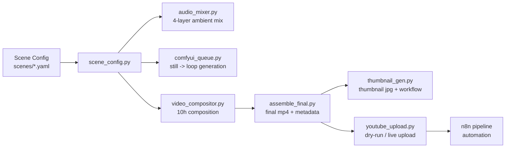

# Library of Longing

> 한국의 기억과 계절감을 담아 10시간 앰비언스 영상을 제작하는 자동화 파이프라인  
> An automated production pipeline for 10-hour ambience videos shaped by Korean memory, place, and season

영문 설명은 아래 [English](#english) 섹션에서 바로 볼 수 있습니다.  
English readers can jump directly to the [English](#english) section below.

## 프로젝트 소개

`Library of Longing`은 한 편의 장면을 하나의 YAML 설정 파일로 정의하고, 그 설정을 기준으로 이미지 생성, 루프 애니메이션 제작, 장시간 영상 합성, 앰비언트 오디오 믹싱, 최종 MP4 조립, 썸네일 제작, YouTube 업로드 준비, n8n 자동화까지 이어지는 제작 시스템입니다.

핵심 목표는 단순한 "배경음 영상"이 아니라, 장소와 계절의 질감을 오래 머물 수 있는 영상으로 만드는 것입니다. 그래서 이 저장소는 단순 스크립트 모음이 아니라, 한 편의 장면을 끝까지 생산 가능한 파이프라인 형태로 구성되어 있습니다.

## 한눈에 보기



## 현재 구현 범위

| 단계 | 파일 | 역할 | 상태 |
|------|------|------|------|
| C8 | `scripts/scene_config.py` | scene YAML 검증, 정규화, 경로 해석 | 완료 |
| C1 | `scripts/audio_mixer.py` | 4-layer 앰비언트 오디오 생성 | 완료 |
| C2 | `scripts/comfyui_queue.py` | ComfyUI 2-stage 이미지/루프 큐잉 | 완료 |
| C3 | `scripts/video_compositor.py` | 루프 클립을 장시간 영상으로 합성 | 완료 |
| C4 | `scripts/assemble_final.py` | 영상+오디오 최종 조립, 메타데이터 생성 | 완료 |
| C5 | `scripts/thumbnail_gen.py` | 썸네일 이미지 렌더 및 변형 workflow 생성 | 완료 |
| C6 | `scripts/youtube_upload.py` | YouTube 업로드 dry-run / live 경로 | 완료 |
| C7 | `n8n/library_of_longing_pipeline.json` | 전체 파이프라인 자동화 워크플로 | 완료 |
| C9.1 | `scripts/audio_sourcing/freesound_fetcher.py` | Freesound CC0 검색, 프리뷰/메타데이터 캐시, MANIFEST 기록 | 완료 |

## 저장소에 포함한 파일과 제외한 파일

이 저장소는 공개 배포를 기준으로 정리되어 있습니다.

포함한 것:

| 포함 대상 | 이유 |
|-----------|------|
| `scripts/` | 실제 실행 코드 |
| `scenes/` | 입력 스키마와 샘플 설정 |
| `workflows/` | ComfyUI workflow 템플릿 |
| `n8n/` | 자동화 workflow |
| `tests/` | 재현 가능한 검증 코드 |
| `fonts/BebasNeue-Regular.ttf` | 썸네일 렌더에 실제로 필요 |
| `README.md` | 사용 문서 |

제외한 것:

| 제외 대상 | 이유 |
|-----------|------|
| `output/` | 생성 산출물, 저장소 불필요 |
| `audio_sources/` | 로컬 자산, 용량 증가 가능 |
| `.pytest_cache/`, `__pycache__/` | 캐시 파일 |
| `.codex/` | 로컬 Codex 보조 파일 |
| `AGENTS.md`, `CLAUDE.md` | AI 작업용 내부 지시서 |
| `Codex_Development_Tasks.md`, `Library_of_Longing_Masterplan.md` | 내부 계획 문서 |
| `docs/superpowers/` | 개발 과정 계획 로그 |

## 디렉토리 구조

```text
Library-of-Longing/
├── README.md
├── .gitignore
├── fonts/
│   └── BebasNeue-Regular.ttf
├── n8n/
│   └── library_of_longing_pipeline.json
├── scenes/
│   ├── schema.yaml
│   └── 001_grandma_porch_summer.yaml
├── scripts/
│   ├── __init__.py
│   ├── scene_config.py
│   ├── audio_mixer.py
│   ├── comfyui_queue.py
│   ├── video_compositor.py
│   ├── assemble_final.py
│   ├── thumbnail_gen.py
│   └── youtube_upload.py
├── tests/
│   ├── conftest.py
│   ├── test_scene_config.py
│   ├── test_audio_mixer.py
│   ├── test_comfyui_queue.py
│   ├── test_video_compositor.py
│   ├── test_assemble_final.py
│   ├── test_thumbnail_gen.py
│   ├── test_youtube_upload.py
│   └── test_n8n_pipeline.py
└── workflows/
    ├── ambient_scene.json
    └── thumbnail.json
```

## 핵심 입력: Scene Config

모든 스크립트는 `scenes/*.yaml`을 기준으로 움직입니다. 즉, 새 영상을 만들 때 가장 먼저 바꿔야 하는 파일은 코드가 아니라 scene YAML입니다.

예시 구조:

```yaml
scene:
  id: "001"
  slug: "grandma-porch-summer"

visual:
  prompt: "..."
  negative_prompt: "..."
  style: "ghibli"
  resolution: [3840, 2160]
  loop_duration_sec: 8
  motion_prompt: "..."

audio:
  layers:
    room_tone:
      source: "audio_sources/grandma_porch/room_tone.wav"
      volume: 0.28
    continuous:
      source: "audio_sources/grandma_porch/fan_loop.wav"
      volume: 0.42
    periodic:
      sources: ["...", "..."]
      interval: [35, 90]
      volume: 0.5
    rare_events:
      sources: ["...", "..."]
      interval: [300, 900]
      volume: 0.32

video:
  target_duration_hours: 10
  film_grain: 15
  vignette: true
  time_lapse: false
  time_lapse_segments:
    - source: "output/video/timelapse/grandma_dawn.png"
      label: "dawn"
```

## 모듈별 상세 설명

### 1. `scene_config.py`

역할:

- YAML 파일을 로드합니다.
- `schema.yaml` 기준으로 구조를 검증합니다.
- 상대 경로를 프로젝트 기준 절대 경로로 정규화합니다.
- 후속 스크립트가 그대로 사용할 수 있는 공통 config 객체를 반환합니다.

중요 포인트:

- `./...` 경로는 scene 파일 기준으로 해석됩니다.
- 일반 상대 경로는 프로젝트 루트 기준으로 해석됩니다.
- `time_lapse_segments`도 함께 정규화됩니다.

### 2. `audio_mixer.py`

역할:

- 장면 설정의 4개 오디오 레이어를 하나의 스테레오 믹스로 합칩니다.

레이어 구성:

| 레이어 | 설명 |
|--------|------|
| `room_tone` | 공간의 바탕 소리 |
| `continuous` | 선풍기, 바람, 장작불 같은 지속음 |
| `periodic` | 매미, 파도, 나뭇잎처럼 자주 반복되는 이벤트 |
| `rare_events` | 유리컵 소리, 부엌 기척, 새소리처럼 드문 이벤트 |

추가 처리:

- 이벤트 랜덤 배치
- 스테레오 패닝
- 루프 경계 크로스페이드
- `-14 LUFS` 근처 정규화
- peak limiter 적용

### 3. `comfyui_queue.py`

역할:

- ComfyUI API를 사용해 2단계 생성 파이프라인을 실행합니다.

동작 순서:

1. SDXL + LoRA로 정적 장면 이미지를 생성
2. 생성된 이미지를 다시 업로드
3. Wan2.2 I2V로 루프 클립 생성

포함 내용:

- `ComfyUIClient` API 래퍼
- workflow JSON 빌더
- dry-run 템플릿 출력
- ComfyUI history polling
- output download helper

### 4. `video_compositor.py`

역할:

- 짧은 루프 클립을 10시간 같은 장시간 영상으로 확장합니다.

지원 모드:

| 모드 | 설명 |
|------|------|
| `basic` | 하나의 루프 클립을 반복해 장시간 영상 생성 |
| `timelapse` | 여러 이미지/클립을 `xfade`로 이어 시간 흐름형 영상 생성 |

후처리 옵션:

- film grain
- vignette
- warm / neutral color temperature
- Lanczos scaling
- 24fps 고정

### 5. `assemble_final.py`

역할:

- C3 영상과 C1 오디오를 최종 MP4로 조립합니다.
- YouTube용 메타데이터 JSON을 생성합니다.
- 썸네일 생성 요청용 JSON도 함께 생성합니다.

출력:

| 파일 | 설명 |
|------|------|
| `*_final.mp4` | 최종 영상 |
| `*.youtube.json` | 업로드용 메타데이터 |
| `*.thumbnail_request.json` | 썸네일 요청 정보 |

### 6. `thumbnail_gen.py`

역할:

- 썸네일 JPG를 로컬에서 렌더합니다.
- ComfyUI용 thumbnail variation workflow도 작성합니다.

처리 방식:

1. 베이스 이미지를 1280x720으로 cover crop
2. 대비/채도/블러 미세 보정
3. 하단 그라디언트 바 추가
4. 한글 제목, 영문 제목, 시간 텍스트 오버레이

### 7. `youtube_upload.py`

역할:

- 최종 MP4와 메타데이터 JSON을 바탕으로 YouTube 업로드 요청을 구성합니다.

안전 원칙:

- 기본 동작은 `dry_run`
- 실제 업로드는 `--live`일 때만 수행
- OAuth client secret/token은 프로젝트 내부가 아니라 `C:\Users\sinmb\key`에서 읽음

### 8. `n8n/library_of_longing_pipeline.json`

역할:

- 수동 실행 또는 주간 스케줄로 전체 파이프라인을 실행하는 n8n workflow입니다.

포함 노드:

| 노드 | 역할 |
|------|------|
| `Manual Trigger` | 수동 시작 |
| `Schedule Weekly` | 주간 자동 시작 |
| `Read Scene Config` | 장면 파일 조회 |
| `Generate Visual Loop` | C2 실행 |
| `Wait for ComfyUI` | 지연/대기 |
| `Compose Video` | C3 실행 |
| `Mix Audio` | C1 실행 |
| `Assemble Final` | C4 실행 |
| `Generate Thumbnail` | C5 실행 |
| `Upload to YouTube` | C6 실행 |
| `Notify Completion` | 종료 알림 자리 |

## 실행 순서

실제 한 편을 수동으로 만들 때 권장 순서는 아래와 같습니다.

```powershell
python scripts/scene_config.py scenes/001_grandma_porch_summer.yaml --pretty
python scripts/audio_mixer.py --scene scenes/001_grandma_porch_summer.yaml --output output/audio/grandma_porch_mix.wav
python scripts/comfyui_queue.py --scene scenes/001_grandma_porch_summer.yaml --write-template workflows/ambient_scene.json --dry-run
python scripts/video_compositor.py --scene scenes/001_grandma_porch_summer.yaml --loop-clip output/video/demo_loop.mp4 --output output/video/demo_10h.mp4 --dry-run
python scripts/assemble_final.py --scene scenes/001_grandma_porch_summer.yaml --video output/video/demo_10h.mp4 --audio output/audio/grandma_porch_mix.wav --output output/final/grandma_porch_final.mp4
python scripts/thumbnail_gen.py --scene scenes/001_grandma_porch_summer.yaml --base-image output/video/demo_still.png --output output/thumbnails/grandma_porch.jpg --write-template workflows/thumbnail.json --uploaded-image-name grandma_porch_still.png
python scripts/youtube_upload.py --video output/final/grandma_porch_final.mp4 --metadata output/final/grandma_porch_final.youtube.json --thumbnail output/thumbnails/grandma_porch.jpg
python scripts/audio_sourcing/freesound_fetcher.py search --query cicada --min-duration 5 --max-duration 20 --max-results 3
python scripts/audio_sourcing/freesound_fetcher.py cache --sound-id 824924 --output-dir audio_sources/smoke
```

## 테스트 및 검증

현재 저장소에서 확인된 검증 결과:

| 항목 | 결과 |
|------|------|
| 전체 테스트 | `pytest tests -v` 기준 `27 passed` |
| C3 스모크 | 실제 FFmpeg 2초 합성 확인 |
| C4 스모크 | 실제 mux + metadata JSON 생성 확인 |
| C5 스모크 | 실제 JPG 썸네일 생성 확인 |
| C6 스모크 | 실제 dry-run JSON 출력 확인 |
| C9.1 스모크 | Freesound CC0 검색 + 실제 MP3 캐시 + MANIFEST 생성 확인 |
| Google API 패키지 | import 확인 |

테스트 실행:

```powershell
pytest tests -v
```

## 현재 남은 것

이 저장소에서 남은 일은 구현이 아니라 현장 연결 확인입니다.

남은 운영 검증:

| 항목 | 설명 |
|------|------|
| ComfyUI live queue | `localhost:8188`에서 실제 prompt/history/view 경로 확인 |
| YouTube live upload | 실제 OAuth 자격으로 `--live` 업로드 확인 |
| n8n import/run | workflow import 후 노드 연결/실행 로그 확인 |

## English

### Overview

Library of Longing is a production pipeline for long-form ambience videos. A single scene YAML drives image generation, loop animation, long-form composition, ambient audio mixing, final MP4 assembly, thumbnail rendering, YouTube upload prep, and n8n automation.

### Included in This Repository

| Included | Why |
|----------|-----|
| `scripts/` | Actual executable pipeline code |
| `scenes/` | Scene schema and sample config |
| `workflows/` | ComfyUI templates |
| `n8n/` | Automation workflow |
| `tests/` | Reproducible verification |
| `fonts/` | Required thumbnail font asset |
| `README.md` | Public-facing documentation |

### Excluded from This Repository

| Excluded | Why |
|----------|-----|
| `output/` | Generated artifacts |
| `audio_sources/` | Local media assets |
| `.codex/`, caches | Local-only helper files |
| `AGENTS.md`, `CLAUDE.md` | Internal AI instruction files |
| planning docs | Internal development process logs |

### Main Modules

| File | Responsibility |
|------|----------------|
| `scripts/scene_config.py` | Load, validate, normalize scene configs |
| `scripts/audio_mixer.py` | Build four-layer ambience mixes |
| `scripts/comfyui_queue.py` | Queue still-to-loop generation in ComfyUI |
| `scripts/video_compositor.py` | Expand loop clips into long-form masters |
| `scripts/assemble_final.py` | Merge video/audio and write sidecar metadata |
| `scripts/thumbnail_gen.py` | Render final thumbnails and write thumbnail workflows |
| `scripts/youtube_upload.py` | Build YouTube upload requests, dry-run by default |
| `scripts/audio_sourcing/freesound_fetcher.py` | Search Freesound CC0 audio, cache previews, and write provenance manifests |
| `n8n/library_of_longing_pipeline.json` | Orchestrate the end-to-end flow |

### Verification

The repository currently passes:

- `pytest tests -v` with `27 passed`
- real FFmpeg smoke runs for composition and final assembly
- real thumbnail JPG rendering
- real YouTube dry-run JSON output
- real Freesound CC0 search and preview cache smoke checks

### Remaining Operational Checks

- live ComfyUI execution against `localhost:8188`
- a real YouTube upload with OAuth credentials
- importing and running the n8n workflow in the target environment
