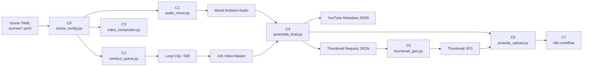

# Library of Longing

> 한국의 기억과 계절감을 담아 10시간 앰비언스 영상을 만드는 자동화 파이프라인입니다.  
> A production pipeline for 10-hour ambience videos shaped by Korean memory, place, and season.

영문 안내: [English](#english)  
English docs: [English](#english)

## 개요

이 프로젝트는 장면 설정 YAML 하나를 기준으로 오디오 믹싱, ComfyUI 이미지/루프 생성, FFmpeg 장시간 합성, 최종 조립, 썸네일 렌더링, YouTube 업로드 준비, n8n 오케스트레이션까지 연결합니다. 현재 `C8 → C1 → C2 → C3 → C4 → C5 → C6 → C7` 전체 골격이 구현되어 있습니다.  
This project connects scene-config YAML, ambient audio mixing, ComfyUI still/loop generation, FFmpeg long-form composition, final assembly, thumbnail rendering, YouTube upload prep, and n8n orchestration. The full `C8 → C1 → C2 → C3 → C4 → C5 → C6 → C7` skeleton is now implemented.



## 상태

| 항목 | 상태 | 메모 |
|------|------|------|
| C8 Scene Config | 완료 | 스키마 검증, 경로 정규화, `time_lapse_segments` 지원 |
| C1 Audio Mixer | 완료 | 4-layer 믹싱 + LUFS 정규화 |
| C2 ComfyUI Queue | 완료 | 2-stage 큐잉, dry-run/단위테스트 완료 |
| C3 Video Compositor | 완료 | 기본 루프 + time-lapse 커맨드 지원 |
| C4 Final Assembly | 완료 | MP4 mux + YouTube metadata JSON + thumbnail request JSON |
| C5 Thumbnail Generator | 완료 | Pillow 렌더 + `workflows/thumbnail.json` 생성 |
| C6 YouTube Upload | 완료 | dry-run 기본, OAuth 기반 live 업로드 경로 구현 |
| C7 n8n Workflow | 완료 | `n8n/library_of_longing_pipeline.json` 작성 |
| 테스트 | 통과 | `pytest tests -v` 기준 `23 passed` |
| 라이브 외부연동 | 부분 보류 | ComfyUI 실큐잉, 실제 YouTube 업로드, n8n import는 현장 환경에서 최종 확인 필요 |

## 빠른 시작

1. 장면 설정 확인  
   Inspect the scene config

   ```powershell
   python scripts/scene_config.py scenes/001_grandma_porch_summer.yaml --pretty
   ```

2. 오디오 생성  
   Render ambient audio

   ```powershell
   python scripts/audio_mixer.py --scene scenes/001_grandma_porch_summer.yaml --output output/audio/grandma_porch_mix.wav
   ```

3. ComfyUI 워크플로 미리보기 또는 큐잉  
   Preview or queue the ComfyUI workflow

   ```powershell
   python scripts/comfyui_queue.py --scene scenes/001_grandma_porch_summer.yaml --write-template workflows/ambient_scene.json --dry-run
   ```

4. 루프 클립 장시간 합성  
   Expand a loop clip into a long-form master

   ```powershell
   python scripts/video_compositor.py --scene scenes/001_grandma_porch_summer.yaml --loop-clip output/video/demo_loop.mp4 --output output/video/demo_10h.mp4 --dry-run
   ```

5. 최종 영상과 메타데이터 조립  
   Assemble the final MP4 and sidecar JSON files

   ```powershell
   python scripts/assemble_final.py --scene scenes/001_grandma_porch_summer.yaml --video output/video/demo_10h.mp4 --audio output/audio/grandma_porch_mix.wav --output output/final/grandma_porch_final.mp4
   ```

6. 썸네일 렌더 및 변형 워크플로 생성  
   Render the thumbnail and write the variation workflow

   ```powershell
   python scripts/thumbnail_gen.py --scene scenes/001_grandma_porch_summer.yaml --base-image output/video/demo_still.png --output output/thumbnails/grandma_porch.jpg --write-template workflows/thumbnail.json --uploaded-image-name grandma_porch_still.png
   ```

7. YouTube 업로드 dry-run  
   Run the YouTube upload path in safe dry-run mode

   ```powershell
   python scripts/youtube_upload.py --video output/final/grandma_porch_final.mp4 --metadata output/final/grandma_porch_final.youtube.json --thumbnail output/thumbnails/grandma_porch.jpg
   ```

## 구조

| 경로 | 설명 |
|------|------|
| `scenes/` | 장면 스키마와 개별 영상 설정 |
| `scripts/` | 전체 파이프라인 실행 스크립트 |
| `workflows/` | ComfyUI 워크플로 템플릿 |
| `n8n/` | 자동화용 n8n workflow JSON |
| `tests/` | pytest 기반 검증 |
| `docs/superpowers/plans/` | 작업 계획 및 실행 기록 |
| `fonts/` | 썸네일/타이틀 카드용 폰트 자산 |

## 현재 검증 범위

| 항목 | 검증 방식 |
|------|-----------|
| C1 Audio Mixer | 단위테스트 + demo WAV 생성 |
| C2 ComfyUI Queue | 단위테스트 + workflow dry-run |
| C3 Video Compositor | 단위테스트 + FFmpeg 스모크 |
| C4 Final Assembly | 단위테스트 + 실제 2초 mux 스모크 |
| C5 Thumbnail Generator | 단위테스트 + 실제 JPG 렌더 |
| C6 YouTube Upload | 단위테스트 + 실제 dry-run JSON 출력 |
| C7 n8n Workflow | JSON 구조 테스트 |

## 다음 단계

남은 일은 구현보다 현장 검증입니다. `ComfyUI localhost:8188` 실큐잉, 실제 YouTube OAuth 업로드, 그리고 `n8n` import 후 실행 로그만 확인하면 운영 단계로 넘어갈 수 있습니다.  
The remaining work is operational verification rather than core implementation. Once live ComfyUI queueing, a real YouTube OAuth upload, and an n8n import/run are confirmed, the pipeline is ready for production use.

---

## English

Library of Longing is a long-form ambience pipeline built around one scene YAML file. It now covers the full implementation skeleton: config loading, ambient audio mixing, ComfyUI still-to-loop generation, FFmpeg long-form composition, final assembly, thumbnail rendering, upload prep, and n8n orchestration.

### Flow

`Scene YAML -> scene_config.py -> audio_mixer.py / comfyui_queue.py / video_compositor.py -> assemble_final.py -> thumbnail_gen.py / youtube_upload.py -> n8n workflow`

### Current Coverage

| Item | Status | Notes |
|------|--------|-------|
| C8 Scene Config | Done | Schema validation, path normalization, and `time_lapse_segments` |
| C1 Audio Mixer | Done | Four-layer ambience mix with loudness normalization |
| C2 ComfyUI Queue | Done | Two-stage still-to-loop workflow, tested with dry-run and unit tests |
| C3 Video Compositor | Done | Basic loop mode and time-lapse command builder |
| C4 Final Assembly | Done | MP4 mux plus YouTube metadata and thumbnail-request sidecars |
| C5 Thumbnail Generator | Done | Local thumbnail rendering plus `workflows/thumbnail.json` |
| C6 YouTube Upload | Done | Safe dry-run by default, live OAuth path implemented |
| C7 n8n Workflow | Done | Orchestration JSON for manual/weekly execution |
| Test Suite | Passing | `23 passed` in the full suite |
| Live Service Checks | Pending | Real ComfyUI queueing, live YouTube upload, and n8n import still need environment-side confirmation |

### Quick Start

```powershell
python scripts/scene_config.py scenes/001_grandma_porch_summer.yaml --pretty
python scripts/audio_mixer.py --scene scenes/001_grandma_porch_summer.yaml --output output/audio/grandma_porch_mix.wav
python scripts/comfyui_queue.py --scene scenes/001_grandma_porch_summer.yaml --write-template workflows/ambient_scene.json --dry-run
python scripts/video_compositor.py --scene scenes/001_grandma_porch_summer.yaml --loop-clip output/video/demo_loop.mp4 --output output/video/demo_10h.mp4 --dry-run
python scripts/assemble_final.py --scene scenes/001_grandma_porch_summer.yaml --video output/video/demo_10h.mp4 --audio output/audio/grandma_porch_mix.wav --output output/final/grandma_porch_final.mp4
python scripts/thumbnail_gen.py --scene scenes/001_grandma_porch_summer.yaml --base-image output/video/demo_still.png --output output/thumbnails/grandma_porch.jpg --write-template workflows/thumbnail.json --uploaded-image-name grandma_porch_still.png
python scripts/youtube_upload.py --video output/final/grandma_porch_final.mp4 --metadata output/final/grandma_porch_final.youtube.json --thumbnail output/thumbnails/grandma_porch.jpg
```

### Directory Map

| Path | Purpose |
|------|---------|
| `scenes/` | Scene schema and per-video configs |
| `scripts/` | Pipeline entry points |
| `workflows/` | ComfyUI workflow templates |
| `n8n/` | n8n orchestration workflow |
| `tests/` | pytest verification |
| `docs/superpowers/plans/` | Execution plans and build notes |
| `fonts/` | Font assets for visual outputs |
