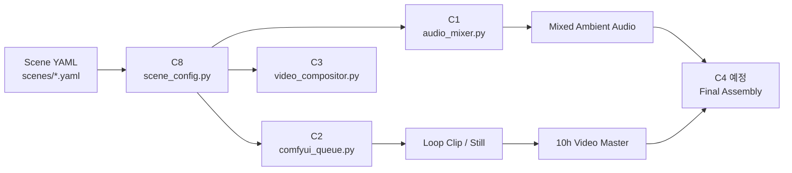

# Library of Longing

> 한국의 기억과 계절감을 담아 10시간 앰비언스 영상을 만드는 자동화 파이프라인입니다.  
> A production pipeline for 10-hour ambience videos shaped by Korean memory, place, and season.

영문 안내: [English](#english)  
English docs: [English](#english)

## 개요

이 프로젝트는 장면 설정 YAML 하나를 기준으로 오디오 믹싱, ComfyUI 이미지/루프 생성, FFmpeg 장시간 합성을 연결합니다. 현재 Phase 1 범위인 `C8 → C1 → C2 → C3`까지 구현되어 수동 제작 1회분을 재현할 수 있습니다.  
This project connects scene-config YAML, ambient audio mixing, ComfyUI still/loop generation, and FFmpeg long-form composition. Phase 1 (`C8 → C1 → C2 → C3`) is implemented and ready for one manual production run.



## 상태

| 항목 | 상태 | 메모 |
|------|------|------|
| C8 Scene Config | 완료 | 스키마 검증 + 경로 정규화 |
| C1 Audio Mixer | 완료 | 4-layer 믹싱 + LUFS 정규화 |
| C2 ComfyUI Queue | 완료 | 2-stage 큐잉, dry-run/단위테스트 완료 |
| C3 Video Compositor | 완료 | 기본 루프 + time-lapse 커맨드 지원 |
| 테스트 | 통과 | `pytest ...` 기준 `11 passed` |
| 라이브 ComfyUI 실행 | 보류 | `http://localhost:8188` 서버 실행 시 최종 확인 필요 |

## 빠른 시작

1. 장면 설정 확인  
   Inspect the scene config

   ```powershell
   python scripts/scene_config.py scenes/001_grandma_porch_summer.yaml --pretty
   ```

2. 오디오 생성  
   Render ambient audio

   ```powershell
   python scripts/audio_mixer.py --scene scenes/001_grandma_porch_summer.yaml --output output/audio/grandma_porch_mix.wav
   ```

3. ComfyUI 워크플로 템플릿 확인 또는 실제 큐잉  
   Preview or queue the ComfyUI workflow

   ```powershell
   python scripts/comfyui_queue.py --scene scenes/001_grandma_porch_summer.yaml --write-template workflows/ambient_scene.json --dry-run
   ```

4. 루프 클립을 장시간 영상으로 합성  
   Expand a short loop into a long-form master

   ```powershell
   python scripts/video_compositor.py --scene scenes/001_grandma_porch_summer.yaml --loop-clip output/video/demo_loop.mp4 --output output/video/demo_10h.mp4 --dry-run
   ```

## 구조

| 경로 | 설명 |
|------|------|
| `scenes/` | 장면 스키마와 개별 영상 설정 |
| `scripts/` | Phase 1 Python 실행 스크립트 |
| `workflows/` | ComfyUI 워크플로 템플릿 |
| `tests/` | pytest 기반 검증 |
| `docs/superpowers/plans/` | 작업 계획 및 실행 기록 |
| `fonts/` | 썸네일/타이틀 카드용 폰트 자산 |

## 다음 단계

다음 구현 우선순위는 `C4 Final Assembly`, `C5 Thumbnail Generator`, 이후 `C6/C7` 자동화입니다. `time_lapse` 세그먼트는 현재 CLI 입력으로 열려 있고, scene 스키마 확장은 `C4` 직전에 추가하는 것이 자연스럽습니다.  
The next implementation priorities are `C4 Final Assembly`, `C5 Thumbnail Generator`, then `C6/C7` automation. `time_lapse` segments are currently CLI-driven, and scene-schema expansion is best added right before `C4`.

---

## English

Library of Longing is a long-form ambience pipeline built around one scene YAML file. It already covers Phase 1: config loading, ambient audio mixing, ComfyUI still-to-loop generation, and FFmpeg-based long-form composition.

### Flow

`Scene YAML -> scene_config.py -> audio_mixer.py / comfyui_queue.py / video_compositor.py -> final assembly (next)`

### Current Coverage

| Item | Status | Notes |
|------|--------|-------|
| C8 Scene Config | Done | Schema validation and path normalization |
| C1 Audio Mixer | Done | Four-layer ambience mix with loudness normalization |
| C2 ComfyUI Queue | Done | Two-stage still-to-loop workflow, tested with dry-run and unit tests |
| C3 Video Compositor | Done | Basic loop mode and time-lapse command builder |
| Test Suite | Passing | `11 passed` in the current Phase 1 suite |
| Live ComfyUI Check | Pending | Needs a running server at `http://localhost:8188` |

### Quick Start

```powershell
python scripts/scene_config.py scenes/001_grandma_porch_summer.yaml --pretty
python scripts/audio_mixer.py --scene scenes/001_grandma_porch_summer.yaml --output output/audio/grandma_porch_mix.wav
python scripts/comfyui_queue.py --scene scenes/001_grandma_porch_summer.yaml --write-template workflows/ambient_scene.json --dry-run
python scripts/video_compositor.py --scene scenes/001_grandma_porch_summer.yaml --loop-clip output/video/demo_loop.mp4 --output output/video/demo_10h.mp4 --dry-run
```

### Directory Map

| Path | Purpose |
|------|---------|
| `scenes/` | Scene schema and per-video configs |
| `scripts/` | Phase 1 Python entry points |
| `workflows/` | ComfyUI workflow templates |
| `tests/` | pytest verification |
| `docs/superpowers/plans/` | Execution plans and build notes |
| `fonts/` | Font assets for visual outputs |
